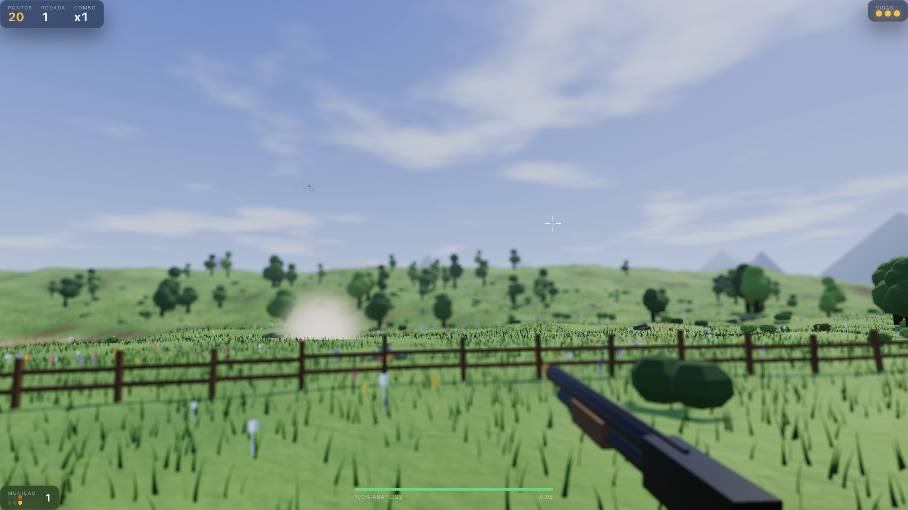
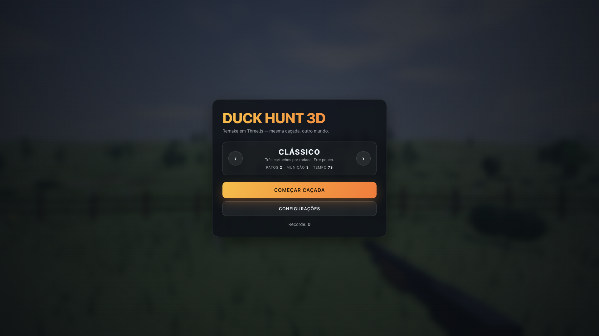

# Duck Hunt 3D

Remake em Three.js do [polon59/Duck_shooter_game_JS](https://github.com/polon59/Duck_shooter_game_JS).
Toda a mecânica do original foi preservada; a camada de apresentação (Canvas 2D + sprites + jQuery)
foi substituída por uma cena 3D com PBR, pós-processamento e áudio espacial.





```bash
npm install
npm run dev      # http://localhost:5173
npm run build    # dist/
```

## Mecânica preservada

| Original | Aqui |
|---|---|
| `Application.js` → escolhe modo | `game/modes.js` + carrossel do menu |
| `Game.js` → rodadas, vidas, 3 subclasses | `game/game.js` (uma implementação, modo como dado) |
| Intro do cão, 7300 ms | `game/dog/dog.js` — mesmos 7,3 s (andar/farejar/andar/farejar/achar/pular) |
| Rodada dura `moves × 1000 ms` | cronômetro em delta time, `moves` segundos |
| Fim por munição zerada / todos abatidos / timeout | idem |
| < 90 % abatidos → perde vida, 3 vidas | idem |
| 1 acerto = 10 pts, n > 1 = 20 × n | idem, × variante do pato × sequência |
| Cão mostra 0/1/2 patos, ri no zero | idem, em 3D |
| Tela final: pontos, rodada, acertos, precisão | idem |
| `flyOut()` dos patos restantes | estado `ESCAPING` |

Diferenças deliberadas: os temporizadores rodam por delta time (pausáveis, imunes a troca de aba)
em vez de `setTimeout`; a dificuldade escala com rodada e pontuação (`game/difficulty.js`);
o hit-test AABB em coordenadas de tela virou raycast contra esferas de acerto, com a espingarda
disparando um feixe central mais um anel de chumbinhos — é o que mantém o combo multi-pato
do original fisicamente coerente com a arma.

## Estrutura

```
src/
  core/      engine (loop), camera (rig), renderer (composer), environment, lights,
             input (mouse/touch/gamepad), assets, settings
  world/     terrain, grass, scatter, water, fence, mountains, sky, rain, wind, textures
  game/      game, modes, difficulty, score
             duck/  duckModel · duckAi · duck · duckPool
             dog/   dogModel · dog
             weapon/shotgun
             ui/    hud · menu
  systems/   shooting · particles · audio · animation
  utils/     math · noise · pool · events
  styles/    ui.css
```

## Assets

**Não há nenhum arquivo binário no projeto.** Modelos, texturas PBR, céu, environment map e
todos os sons são gerados em código:

- **Modelos** — `BufferGeometry` mesclada por parte, com pivôs articulados (asas de dois
  segmentos, pescoço, mandíbula, quatro patas).
- **Céu e environment map** — shader procedural (Rayleigh aproximado + sol + dois estratos de
  nuvem por fBm) capturado com `PMREMGenerator`, o que dá reflexo e ambient coerentes com o clima.
- **Texturas** — normal / roughness / AO geradas como `DataTexture` a partir de fBm tileável.
- **Áudio** — DSP direto no buffer (`AudioContext`): tiro, bombeamento, grasnado, latido, risada,
  vento, pássaros, impacto, além de um impulso de reverb para o eco do campo aberto.

### Trocar por assets autorais

`core/assets.js` já traz `GLTFLoader` + `DRACOLoader` com fallback procedural por chave.
Para usar um modelo próprio de pato:

```js
await assets.tryLoadModel('duck', 'assets/models/duck.glb');
```

O `duckPool` passa a instanciar o GLTF em vez do modelo procedural. Os pivôs são resolvidos por
nome — `body`, `head`, `shoulder-left`, `elbow-left`, `shoulder-right`, `elbow-right`. Se o GLB
trouxer clips de animação, eles são registrados no `AnimationMixer` (`systems/animation.js`) e a
pose procedural se desliga sozinha. **Este caminho está implementado mas não exercitado** — não
há nenhum `.glb` no repositório para testá-lo.

## Desempenho

`InstancedMesh` para grama, árvores, arbustos, flores, pedras e cerca; LOD estático por distância
nas árvores; object pool para patos, partículas e cartuchos (nada é alocado durante o gameplay);
partículas em buffers de capacidade fixa com compactação por swap; vento inteiramente no vertex
shader. Quatro presets de qualidade em `core/settings.js`, com detecção automática por
`hardwareConcurrency` / `deviceMemory` / tipo de ponteiro.

Medido: 120 FPS (limite do monitor) em desktop, preset alto, 1230 × 1262.

## Controles

Mouse, toque e gamepad (stick direito mira, RT/A dispara). `Esc` volta ao menu, `F3` alterna o
overlay de debug/FPS. Configurações de qualidade, clima, volumes e sensibilidade persistem em
`localStorage`.

`OrbitControls` só é carregado em `import.meta.env.DEV` (via `import()` dinâmico, fora do bundle
de produção) e fica desligado até `window.__orbit(true)` no console.
